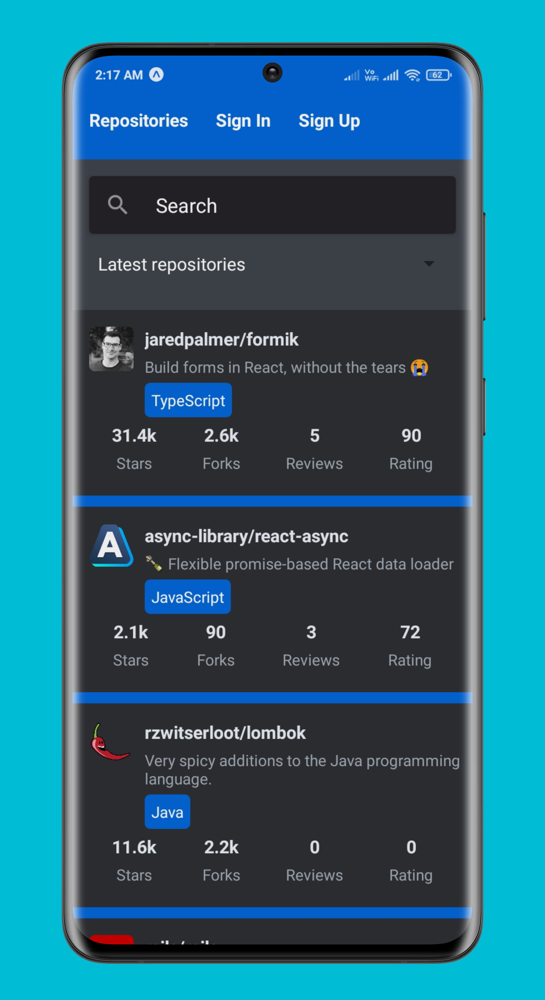
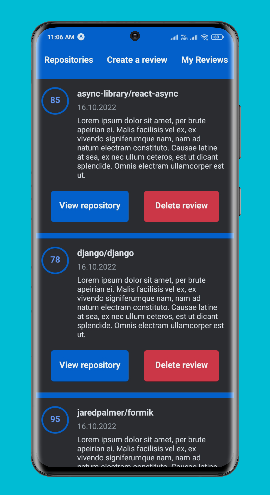

# Rate Repository App

React Native mobile application for rating GitHub repositories.

More app demo images: [DarkTheme](https://github.com/D-Hemanth/rate-repository-app/tree/main/app-mockups/darkTheme) || [LightTheme](https://github.com/D-Hemanth/rate-repository-app/tree/main/app-mockups/lightTheme)

## rate-repository-app gif:

- **without-login:**

  

- **logged-in:**

  

## Rate repository app:

- The app was bootstrapped with [Create React Native App](https://github.com/react-community/create-react-native-app) and is running on Expo.
- The app has the following properties:
  - user sign in/out
  - sign up for new users
  - view all reviewed repositories
  - signed in user can create reviews
  - view reviews created by the signed in user

## Technologies used in this project:

- Expo CLI
- React Native, React Router Native
- Apollo Client, GraphQL
- Formik & Yup
- Jest & React Native Testing Library
- ESLint

## Configuration

Set up the rate-repository-api server by following the setup instructions in the repository's [README](https://github.com/fullstack-hy2020/rate-repository-api/blob/master/README.md). Note that if you are using an emulator for development it is recommended to run the server and the emulator on the same computer. This eases network requests considerably.

#### To get set up, run the following in your cloned directory

`npm install`

`npm start`
